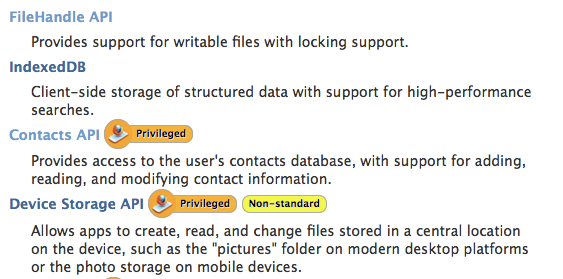

# 基础概念 {#concepts}

在我们开始折腾和构建我们第一个应用之前，让我们来学习一些关于开发Firefox OS基础概念。我们在[简介](#introduction)中学到了在Firefox OS中的应用如同网页一样基于HTML5。然而我们没解释为什么Firefox OS不同于常规的网页。

若将我们对于其他平台的知识集中起来，我们会看到原生应用通常会有：

* 一个名称和图标可以被用户按下并启动应用。
* 使用系统服务和硬件的权限。

总体上说，Firefox OS应用只是一个有图标和名字并且通常可以离线工作（取决于应用被如何实现）的网页。一个应用的所有数据，比如名称、图标或其他都是在一个 *应用清单（manifest）文件* 中被定义的，这将是我们下一部分的重点。

## 应用清单

应用清单[manifest](https://developer.mozilla.org/docs/Apps/Manifest)是一个[JSON](http://json.org)文件，用于描述web应用托管方面的部分。通常这个文件被命名为 **manifest.webapp** 并且和你的主HTML文件在一起，这个文件通常命名为 **index.html**。

<<[Manifest示例](code/sample_manifest.webapp)

在上面的示例中我们能看到这个manifest文件是为了一个叫做memos[^memos]的应用。除了其他方面，它还描述了应用的作者、应用的图标、应用的名称、应用的启动文件（该示例中为 *index.html*）、你的应用需要的硬件使用权限等。该文件被用于Firefox OS操作系统添加应用到设备的主屏幕还有下面我们看到的图片则用于在Firefox Marketplace应用市场的目录中显示。

[^memos]：这是一个Firefox OS的简单应用，在[Firefox Marketplace应用市场能看到](https://marketplace.firefox.com/app/memos)其[源代码在GitHub上](https://github.com/soapdog/memos-for-firefoxos).

注意manifest中的信息是如何被系统用于添加应用到主屏幕的，我们可能从下面的截图看到。

集合你的HTML、CSS、JavaScript和一个manifest文件你已经拥有一个能运行在Firefox OS上的应用了。接着我们关于基础概念的话题，让我们继续学习还有什么应用类型。

## 应用类型

Firefox OS目前有两种应用类型：托管应用和打包应用 - 不过将来会有更多的类型被接受（如自定义键盘和创建其他系统服务的能力）。

* **托管应用：** 就像一般的网站一样被托管在一个web服务器上。这意味着当用户运行一个托管应用时，它的内容是从远程服务器上加载的（或者缓存，如果有的话）。
* **打包应用：** 是以Zip文件被发布的，在安装被复制到设备上。当用户运行一个打包应用时，它的内容将从zip文件中加载，而不是远程服务器。

这两种类型各有优缺点。一方面，托管应用比较容易维护，因为所有你需要做维护的文件都在你的web服务器上。然而，使他们离线工作是比较难的，因为它需要使用万恶的[**appcache**](https://developer.mozilla.org/pt-BR/docs/HTML/Using_the_application_cache)。托管应用能使用的WebAPI也是受限的，这意味着它们不能做一个打包应用能做的所有事情。

另一方面，打包应用会把所有内容存储在设备中 - 这意味着当离线时它们总是可用的（所以也不需要appcache）。它们还能够使用那些没有提供给托管应用的安全敏感的WebAPI。更新它们可能有点痛苦，因为你需要把Firefox Marketplace应用市场上的版本更新到一个任意的新版本 - 这意味着需要通过一个审核过程，会花费一些时间。

当尝试选择一个应用类型来构建时，考虑一下，如果你需要高级的WebAPI，那么你应该使用打包应用。然而，如果你的应用没有需要使用任何除了web浏览器中已有的服务的高级系统服务和硬件功能也能运转的很好，那么总应选择托管应用。如果你没有地方托管它也可以使用打包应用。

以上我提到的appcache可能会有问题（有时候托管应用是需要的）。不用太担心，有一些有效的工具去生成appcache使之易于开发[^js-tools]。

在本书中我们将构建打包应用，因为它允许我们去探索可能的WebAPI。不过大部分我们会学习manifest应用于托管应用。如果你想更多的了解关于发布托管应用，浏览[开发者中心的托管应用链接](https://marketplace.firefox.com/developers/docs/hosted)。

[^js-tools]：这里有许多可用的工具，[Grunt](gruntjs.com)、 [Volo](http://volojs.org/)、 [Yeoman](http://yeoman.io/)、 [Bower](http://bower.io/)。 这些工具中有些是重复的，就看你喜欢使用哪个了（我通常喜欢Volo胜于Grunt，因为我读起Volofiles来更容易）。

现在我们已经介绍了Firefox OS对于两种应用类型的支持情况，让我们来看看它们所能使用的系统级别上的区别。

## 安全使用权限

在Firefox OS上有三种安全等级 - 每个级别都比上一个级别有更多可使用的API。

* **普通（又称为web）：** 这是所有应用的默认权限。该级别适用于托管应用和打包应用，在manifest文件中无需声明 `type` 属性。这些应用可使用通常在浏览器中能找到的API集 - 但不能使用任何Mozilla的WebAPI。
* **特权：** 这类型的应用可使用所有的通常在Firefox浏览器中能找到的API，还有一些附加的，比如通讯录和系统闹钟。只有 **打包应用可以为特权应用**，而且这个包必须是被Firefox OS marketplace应用市场认证的。
* **认证:** 因为安全原因，这个级别仅适用于Mozilla及其合作伙伴（比如手机厂商，电信等）。被认证的应用能使用所有API，比如通话之类的。一个被认证应用的例子就是Firefox OS的拨号器应用。

在开发中，我们可以使用所有特权API而不需要Mozilla任何的许可，这很重要。但是当我们想要发布一个特权应用时，首先它需要放到Firefox Marketplace应用市场上。在这，检查这些代码是一个严格审批过程的一部分，如果发现是好的，它将被认证 - 告诉Firefox OS的用户该应用被允许使用敏感的API。

在[Mozilla开发者网络上的WebAPI页面](https://developer.mozilla.org/en-US/docs/WebAPI)上我们能看到API的实践，使用每一个API需要什么平台和什么使用权限。

比如我们能在上图中看到，任何应用都可以使用*IndexedDB接口和FileHandle接口*，但是只有特权应用能使用*Contacts接口和Device Storage接口*。

## Mozilla的WebAPI

Firefox OS为我们提供API使我们能够构建一些就像在其他平台上的原生应用相同能力的应用，通过WebAPI使用硬件和服务。学习更多关于当前Firefox OS版本可用API列表，可访问[Mozilla维基上的WebAPI页面](https://wiki.mozilla.org/WebAPI)。

让我们查看一些示例代码，看看那些API是如何的易用。不要把这些例子作为WebAPI的全部文档，它们只是一个很小的样例，使你了解我们可以如何通过JavaScript使用设备特性。

### 例 1：打电话

想象你有一个应用需要打开一个存满电话号码的拨号器。你只能使用如下代码。

<<[发送一个电话号码到拨号器](code/webapi_samples/dial.js)

这段代码会产生一个请求到拨号器应用并拨打指定的号码。注意，这不能真的进行一次呼叫 - 用户仍将需要按下拨出按钮来进行呼叫。在执行一些其他的操作前明确的询问用户行为是很常见的：这是非常安全的模式，因为需要用户在允许一些事发生前同意需要的交互。其他一些可以直接拨出电话而不用用户交互的API，则需要更高的使用权限。认证应用能直接拨出电话而无需例子中的交互。上面例子中使用的API叫做`Web Activities`，可用于所有应用。

在Mozilla的博客可以找到[更多关于Web Activites的信息](https://hacks.mozilla.org/2013/01/introducing-web-activities/)。

### 例 2：保存联系方式

想象你有一个公司内的局域网，并且你想提供一个从局域网地址簿传输联系方式到手机地址簿的方法。你可以使用Contacts API。

<<[保存联系方式](code/webapi_samples/contact.js)

这个API创建了一个包含联系人数据的对象，并且不需要用户的交互就能将它保存到手机地址簿。因为访问联系人带有潜在的隐私问题，这个API只能适用于特权应用。你可以创建一个包含success和error的回调函数的对象，该模式在需要WebAPI中都有使用。

关于该API的更多信息，可以阅读[Moziila维基上的*Contacts API*页面](https://wiki.mozilla.org/WebAPI/ContactsAPI)。

### 例 3：从相机选择一张照片。

想象你正构建一个可使用各种滤镜照片的应用。你想在你的应用中放置一个按钮用于让用户从相册或相机选择一张照片。

<<[选择一个图片](code/webapi_samples/pick.js)

我们先看另一个[WebActivity](https://hacks.mozilla.org/2013/01/introducing-web-activities/)的例子。这些活动适用于所有应用。在这个特别的样例中我们使用*pick*活动并通过它获取我们希望取回的文件的*MIME Types*。当这段代码被执行，系统会显示一屏用于询问用户从哪获取一个图片（相机，照片流，壁纸）。如果用户选择一个图片，则回调函数success将被触发。如果用户取消操作，则回调函数error将被执行。在上图中，我们能看到对话框让用户从设备中选择一个照片。

## 总结

在这一章中，我们说到了不同于常规网页，Firefox OS的托管应用和打包应用依赖于manifest文件。我们还说到了站在安全角度上看，打包应用可以是“特权”或“认证”的。只有特权和认证应用可以使用Mozilla强大的WebAPI集。这些WebAPI不适用于托管应用或常规网页。

现在是我们开始折腾然后创建一个应用的时候了。
