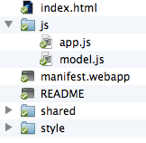
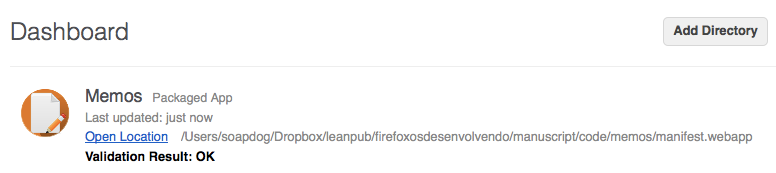

# 我们的第一个应用 {#firstapp}

在这一章节，我们将建立一个简单的 **Memos** 应用，这是一个做笔记的应用。在编码前先让我们来看看这个应用的功能。

该应用有三个界面。第一个是主界面，有一个被存储的你的笔记的标题的列表。当你点击一个笔记（或添加一个新笔记）你将转到详情界面，可以让你编辑这个笔记的内容和标题。如下图所示。

在上面显示的界面中，用户点击垃圾桶图标就可以选择是否删除被选中的笔记。这将引发一个确认对话框被显示出来。

可用的Memos源代码在[Memos的Github仓库](https://github.com/soapdog/memos-for-firefoxos)上（也可用[.zip](https://github.com/soapdog/memos-for-firefoxos/archive/master.zip)文件）。我建议你下载这个文件，这样更易于接下去的学习。可用源代码的另一份副本在[本书Github仓库](https://github.com/soapdog/firefoxos-quick-guide)里的 **code** 文件夹中。

Memos使用[IndexedDB](https://developer.mozilla.org/en-US/docs/IndexedDB/Using_IndexedDB)存储笔记并使用[盖亚构建模块](http://buildingfirefoxos.com/building-blocks)构建接口。以后更新本书时，我将谈到更多的盖亚构建模块，但在第一本中我只会使用它们。关于它们，你可以点开上面的链接学习更多的内容，以及它们提供的用户界面工具。

第一步是创建应用程序的文件夹，我们来给这个文件夹命名为**memos**。

## 创建应用清单（Manifest）

Memos的清单是优雅而简介的。在**memos**文件夹中创建名为**manifest.webapp**的文件。清单是描述应用的[JSON](http://json.org)文件。在该文件中我们写一些东西，比如应用的名称、开发者是谁、使用的图标是什么、运行应用的文件是什么、想要使用什么特权API，还有其他的。

在下面我们能看到Memos应用清单的内容。复制这些数据时要注意，因为非常容易在错误的地方写逗号导致JSON格式错误。这里有许多你能用来验证JSON文件的工具，不过这还有一个特别的可以构建特殊的应用清单。你可以从[http://appmanifest.org/](http://appmanifest.org/)找到这个在线工具。想学习更多关于应用清单的信息，阅读[MDN相关信息的页面](https://developer.mozilla.org/docs/Apps/Manifest)。

<<[Memos清单文件 (*manifest.webapp*)](code/memos/manifest.webapp)

我们来从上面的清单中看看字段。

|字段		|描述                                                                        |
|-----------|-----------------------------------------------------------------------------------|
|name		|这是应用的名称。		                                                |
|version	|这是应用的当前版本。				    |
|launch_path|被用于启动你的应用的文件是什么。					                    |
|permissions|你的应用请求什么API许可。更多相关信息在下面。				|
|developer  |谁开发了这个应用。 													|
|icons		|应用使用的许多不同尺寸的图标。									|

该清单最有趣的部分是permissions字段，我们请求*storage*许可来允许我们无存储限制的使用IndexedDB[^storage-permission]（多亏那个许可，我们才能尽可能多的存储我们想要的笔记，尽管我们应该注意不要过多使用用户的磁盘空间！）。

[^storage-permission]: 学习更多关于permissions许可的信息，阅读[MDN关于许可的页面](https://developer.mozilla.org/en-US/docs/Web/Apps/App_permissions)。

现在清单已经准备好了，我们该看看HTML了。

## 构建HTML

在我们在HTML上开始工作前，我们先来简短的谈谈[盖亚构建模块](http://buildingfirefoxos.com/building-blocks)，这是一个有着Firefox OS*感观*的可重用的CSS和JS集合，我们可以在我们自己的应用中使用。

正如网页中，你不需要在你自己的应用中使用Firefox OS的*感观*。使用或不使用盖亚构建模块是你个人的决定，而且一个良好的应用应该具有它自己的独特风格和用户体验。重要的是应该了解到，即使不使用盖亚感观你的应用也不会在Firefox Marketplace应用市场中遭受任何类型的偏见和处罚。我使用它，因为我不是个良好的设计师，所以现成的设计用户界面的工具很吸引我（要么雇佣一个设计师）。

我们在应用中使用的HTML的结构是被盖亚构建模块所采用的模式，每个界面是一个`<section>`，该元素使用某个预处理格式。如果你没有准备好，可以从[memos仓库](https://github.com/soapdog/memos-for-firefoxos)下载源代码，使用这些文件（包括构建模块）。对于那些不信任git和GitHub的，这个[.zip file](https://github.com/soapdog/memos-for-firefoxos/archive/master.zip)文件也是可用的。

W> 注意：我在这个应用中使用的盖亚构建模块的版本不是从Mozilla获取的最新的。不幸地是，若尝试更新到当前的版本将破坏该Memos应用。在你自己的项目中，无论如何一定要使用最新版本的盖亚构建模块。

### 包含的构建模块

在做任何事之前，在你创建的**memos**文件夹中复制从Memos仓库下载获取到的**shared**和**styles**文件。这将允许在我们的应用中使用盖亚构建模块。

让我们从我们的**index.html**文件开始，包括所需的一些东西。

~~~~~~~~
<!DOCTYPE html>
<html>
<head>
    <meta charset="utf-8">
    <link rel="stylesheet" type="text/css" href="/style/base.css" />
    <link rel="stylesheet" type="text/css" href="/style/ui.css" />
    <link rel="stylesheet" type="text/css" href="/style/building_blocks.css" />
    <link rel="stylesheet" type="text/css" href="shared/style/headers.css" />
    <link rel="stylesheet" type="text/css" href="shared/style_unstable/lists.css" />
    <link rel="stylesheet" type="text/css" href="shared/style_unstable/toolbars.css" />
    <link rel="stylesheet" type="text/css" href="shared/style/input_areas.css" />
    <link rel="stylesheet" type="text/css" href="shared/style/confirm.css" />
    <title>Memos</title>
</head>
~~~~~~~~

在*行01*中我们声明DOCTYPE为HTML5。从*行05*到*行15*，我们引入各种在我们的应用中使用的组件的CSS，比如头部、列表、文本输入字段和其他。

### 建立主界面

现在我们可以开始建立各种界面。像之前提到的一样，每个界面在我们的应用中是一个在`<body>`中的`<section>`。body标签必须有一个*role*属性，它的值为*application*，因为那是被CSS选择器用于构建接口的，所以我们的body标签是`<body role="application">`。让我们建立第一个界面并声明我们的body标签。

~~~~~~~~
<body role="application">

<section role="region" id="memo-list">
    <header>
        <menu type="toolbar">
            <a id="new-memo" href="#">add</a>
        </menu>
        <h1>Memos</h1>
    </header>
    <article id="memoList" data-type="list"></article>
</section>
~~~~~~~~

我们的界面中有一个`<header>`包括添加新笔记按钮和应用名称。界面中还有`<article>`用来放置被存储笔记的列表。当我们延伸到JavaScript实现部分时，我们将使用按钮和文章ID捕获事件。

注意，每个界面就相当于是一个HTML块。构建使用不同语言的相同界面通常需要做许多其他工作。我们正在做的事就是声明我们的容器并在我们需要在之后引用它们时，获取它们的ID。

现在主界面做好了，我们来构建编辑界面。

### 建立编辑界面

编辑界面会更复杂一些，因为还放置了一个对话框，用于当用户尝试删除一个笔记的时候。

~~~~~~~~
<section role="region" id="memo-detail" class="skin-dark hidden">
    <header>
        <button id="back-to-list">back
        </button>
        <menu type="toolbar">
            <a id="share-memo" href="#">share
            </a>
        </menu>
        <form action="#">
            <input id="memo-title" placeholder="Memo Title" required="required" type="text">
            <button type="reset">Remove text</button>
        </form>
    </header>
    

        <textarea placeholder="Memo content" id="memo-content"></textarea>
    

    

        <ul>
            <li>
                <button id="delete-memo" class="icon-delete">Delete</button>
            </li>
        </ul>
    

    <form id="delete-memo-dialog" role="dialog" data-type="confirm" class="hidden">
        <section>
            <h1>Confirmation</h1>
            
Are you sure you want to delete this memo?

        </section>
        <menu>
            <button id="cancel-delete-action">Cancel</button>
            <button id="confirm-delete-action" class="danger">Delete</button>
        </menu>
    </form>
</section>
~~~~~~~~

在界面的顶部，仍然出现了`<header>`元素，里面有：

 * 返回按钮，回到主界面。
 * 文本字段用来放得到的笔记的标题，
 * 并且按钮被用于通过电子邮件分享笔记。

在下面的顶部工具栏中，我们有一段放着一个 `<textarea>` ，那写着笔记的内容和另一个工具栏，包括用于删除当前浏览的笔记的垃圾箱按钮。

这三个元素和它们的子节点都是编辑界面。在它们后面我们有 `<form>` ，用来作为包含确认界面的对话框，当他或她试图删除一个笔记时就为用户呈现它。该对话框非常简单，它仅包含确认提示的文本和两个按钮；一个删除笔记而另一个取消这个动作。

现在我们闭合了这个 `<section>` 我们实现了所有的界面并且剩下的HTML代码只有引入JavaScript文件和闭合html文件了。

~~~~~~~~

</body>
</html>
~~~~~~~~

## 加工JavaScript代码

现在我们通过添加JavaScript为我们的应用注入活力。为了更好的组织代码，我将JavaScript代码划分到了两个文件里：

* **model.js:** 包括常规的处理存储和笔记检索，但不包括任何应用程序逻辑或任何有关接口或数据字段的东西。理论上我们能在其他需要文本笔记的应用程序重用相同文件。
* **app.js:** 为HTML元素绑定它们的事件处理器以及包括应用程序逻辑。

两个文件都应被放在一个**js**文件夹，之后还有**style** 和 **shared** 文件夹。

### model.js

我们将使用[IndexedDB](https://developer.mozilla.org/en-US/docs/IndexedDB/Using_IndexedDB)来存储我们的笔记。从我们在应用程序的清单中要求了*存储*许可，我们想存多少就存储多少。无论如何，我们不该滥用它！Firefox OS设备通常存储空间非常有限，所以你总需要考虑周全你要存储的数据是什么（如果你的应用使用太多的存储空间，用户会删除它并且它的下载率也将减少）。存储过多的数据有点性能损失，使你的应用感觉很慢。当你提交一个应用到Firefox OS marketplace应用市场时也请注意，审查员们会询问你为什么需要无限存储空间，如果你没有正当的原因，你的应用将被拒。

下面显示的*model.js*的这部分代码是可响应打开链接和创建存储的。

A> 重要提示：该代码被写的浅显易懂并且不能表现最佳JS编程实践。使用了一些全局变量（我真该下地狱）等花絮。错误处理代码基本上是不存在的。本书的主要目的是教授为Firefox OS开发应用的*工作流*，而不是教最好的JS模式。话虽然这么说，根据反馈我会在本书中更新这部分代码，以更好的反映最佳实践，只要有够多的人认为这不会影响初学者。

~~~~~~~
var dbName = "memos";
var dbVersion = 1;

var db;
var request = indexedDB.open(dbName, dbVersion);

request.onerror = function (event) {
    console.error("Can't open indexedDB!!!", event);
};
request.onsuccess = function (event) {
    console.log("Database opened ok");
    db = event.target.result;
};

request.onupgradeneeded = function (event) {

    console.log("Running onUpgradeNeeded");

    db = event.target.result;

    if (!db.objectStoreNames.contains("memos")) {

        console.log("Creating objectStore for memos");

        var objectStore = db.createObjectStore("memos", {
            keyPath: "id",
            autoIncrement: true
        });
        objectStore.createIndex("title", "title", {
            unique: false
        });

        console.log("Adding sample memo");
        var sampleMemo1 = new Memo();
        sampleMemo1.title = "Welcome Memo";
        sampleMemo1.content = "This is a note taking app. Use the plus sign in the topleft corner of the main screen to add a new memo. Click a memo to edit it. All your changes are automatically saved.";

        objectStore.add(sampleMemo1);
    }
}
~~~~~~~

A> 重要提示：为了大局，再次原谅我，这仅是教学资源。另一个细节是我删除了本书中源代码的注释来节省空间。如果你从GitHub找出源代码你就会获得全部的注释。

上面的代码创建了一个*db*对象和一个*request*对象。*db*对象在源代码中被其他函数用于笔记存储操作。

在`request.onupgradeneeded`方法的实现中我们还创建了欢迎笔记。当应用程序第一次运行时该方法就会被执行（或当数据库版本改变时）。该方法就是一旦应用程序第一次启动，数据库就会被初始化并生成一个欢迎笔记。

在我们打开链接以及初始化存储的同时来实现笔记操作的基础功能。

~~~~~~~~
function Memo() {
    this.title = "Untitled Memo";
    this.content = "";
    this.created = Date.now();
    this.modified = Date.now();
}

function listAllMemoTitles(inCallback) {
    var objectStore = db.transaction("memos").objectStore("memos");
    console.log("Listing memos...");

    objectStore.openCursor().onsuccess = function (event) {
        var cursor = event.target.result;
        if (cursor) {
            console.log("Found memo #" + cursor.value.id + " - " + cursor.value.title);
            inCallback(null, cursor.value);
            cursor.continue();
        }
    };
}

function saveMemo(inMemo, inCallback) {
    var transaction = db.transaction(["memos"], "readwrite");
    console.log("Saving memo");

    transaction.oncomplete = function (event) {
        console.log("All done");
    };

    transaction.onerror = function (event) {
        console.error("Error saving memo:", event);
        inCallback({
            error: event
        }, null);

    };

    var objectStore = transaction.objectStore("memos");

    inMemo.modified = Date.now();

    var request = objectStore.put(inMemo);
    request.onsuccess = function (event) {
        console.log("Memo saved with id: " + request.result);
        inCallback(null, request.result);

    };
}

function deleteMemo(inId, inCallback) {
    console.log("Deleting memo...");
    var request = db.transaction(["memos"], "readwrite").objectStore("memos").delete(inId);

    request.onsuccess = function (event) {
        console.log("Memo deleted!");
        inCallback();
    };
}
~~~~~~~~

在上面的代码片段中，我们创建了构造函数来创建新的Memos和一些已经初始化的文件夹。然后我们实现笔记的列表、保存和删除功能。许多功能接受一个叫`inCallback`的回调参数，在那些函数做完它们的事之后会调用这个回调函数。由于IndexedDB的异步性质，这是必要的。所有回调都有相同的名字就是`callback(error, value)` ，value也有可能是null，这取决于上一函数的结果。

A> 从本书一开始，我就选择不去使用[*Promises*](https://developer.mozilla.org/en-US/docs/Mozilla/JavaScript_code_modules/Promise.jsm/Promise)，因为许多初学者不太熟悉这个概念。我推荐使用这些概念来更简单的创建和维护代码，以至于更舒适的阅读。

现在，我们的笔记存储和操作函数准备好了，让我们在**app.js**文件中实现应用逻辑。

### app.js

该文件将包括我们的应用逻辑。由于源代码对于我来说放置在本书中太大了，我将拆成几部分并解释每部分。

~~~~~~~~
var listView, detailView, currentMemo, deleteMemoDialog;

function showMemoDetail(inMemo) {
    currentMemo = inMemo;
    displayMemo();
    listView.classList.add("hidden");
    detailView.classList.remove("hidden");
}

function displayMemo() {
    document.getElementById("memo-title").value = currentMemo.title;
    document.getElementById("memo-content").value = currentMemo.content;
}

function shareMemo() {
    var shareActivity = new MozActivity({
        name: "new",
        data: {
            type: "mail",
            body: currentMemo.content,
            url: "mailto:?body=" + encodeURIComponent(currentMemo.content) + "&subject=" + encodeURIComponent(currentMemo.title)

        }
    });
    shareActivity.onerror = function (e) {
        console.log("can't share memo", e);
    };
}

function textChanged(e) {
    currentMemo.title = document.getElementById("memo-title").value;
    currentMemo.content = document.getElementById("memo-content").value;
    saveMemo(currentMemo, function (err, succ) {
        console.log("save memo callback ", err, succ);
        if (!err) {
            currentMemo.id = succ;
        }
    });
}

function newMemo() {
    var theMemo = new Memo();
    showMemoDetail(theMemo);
}
~~~~~~~~

在开头我们声明了一些全局变量（可恶！！！）用来存放引用一些DOM元素，我们稍后想在一些函数中使用。最有趣的全局变量是`currentMemo`，它是用于存放当前用户阅读到的笔记内容的对象。

`showMemoDetail()` 和 `displayMemo()` 函数在一起工作。前者载入被选择的笔记到 `currentMemo` 中并操作元素的CSS，以此来显示编辑界面。后者从 `currentMemo` 变量中挑出内容并在界面中放置它。我们可以在同一函数中做这两件事，但分开它们能更易于实验新的实现。

`shareMemo()` 函数使用[WebActivity](https://hacks.mozilla.org/2013/01/introducing-web-activities/)去打开邮件应用并新建一个预先写入被选择笔记内容的邮件。

`textChanged()` 函数挑出整个文件夹中的数据并填入 `currentMemo` 对象中，然后保存笔记。你的内容总会被保存，因为该应用程序是‘自动保存’应用。笔记所有的内容或标题的改变都将触发该函数并且笔记将总是被保存在IndexedDB存储中。

`newMemo()` 函数创建一个新笔记并打开编辑界面编辑它。

~~~~~~~~
function requestDeleteConfirmation() {
    deleteMemoDialog.classList.remove("hidden");
}

function closeDeleteMemoDialog() {
    deleteMemoDialog.classList.add("hidden");
}

function deleteCurrentMemo() {
    closeDeleteMemoDialog();
    deleteMemo(currentMemo.id, function (err, succ) {
        console.log("callback from delete", err, succ);
        if (!err) {
            showMemoList();
        }
    });
}

function showMemoList() {
    currentMemo = null;
    refreshMemoList();
    listView.classList.remove("hidden");
    detailView.classList.add("hidden");
}
~~~~~~~~

`requestDeleteConfirmation()` 函数是显示响应的，该笔记的可移动确认对话框。

`closeDeleteMemoDialog()` 和 `deleteCurrentMemo()` 函数是被可移动确认对话框上的按钮触发的。

`showMemoList()` 函数在显示被存储的笔记之前做一些清理工作的。比如它清除 `currentMemo` 的内容，因此我们还不能读到任何备忘录。

~~~~~~~~
function refreshMemoList() {
    if (!db) {
        // HACK:
        // this condition may happen upon first time use when the
        // indexDB storage is under creation and refreshMemoList()
        // is called. Simply waiting for a bit longer before trying again
        // will make it work.
        console.warn("Database is not ready yet");
        setTimeout(refreshMemoList, 1000);
        return;
    }
    console.log("Refreshing memo list");

    var memoListContainer = document.getElementById("memoList");

    while (memoListContainer.hasChildNodes()) {
        memoListContainer.removeChild(memoListContainer.lastChild);
    }

    var memoList = document.createElement("ul");
    memoListContainer.appendChild(memoList);

    listAllMemoTitles(function (err, value) {
        var memoItem = document.createElement("li");
        var memoP = document.createElement("p");
        var memoTitle = document.createTextNode(value.title);

        memoItem.addEventListener("click", function (e) {
            console.log("clicked memo #" + value.id);
            showMemoDetail(value);

        });

        memoP.appendChild(memoTitle);
        memoItem.appendChild(memoP);
        memoList.appendChild(memoItem);

    });
}
~~~~~~~~

`refreshMemoList()` 函数通过构建显示在屏幕上的笔记列表元素来改变DOM。使用一些模版的帮助是非常简单的，比如[handlebars](http://handlebarsjs.com/) 或 [underscore](http://underscorejs.org/)，但由于该应用没有使用什么来构建，*vanilla javascript*，我们手写了一些东西。该函数被命名为 `showMemoList()` 如下所示。

这里是所有我们应用所使用的函数。只有一部分代码没有，就是事件绑定初始化和 `refreshMemoList()` 的初始调用。

~~~~~~~
window.onload = function () {
    // elements that we're going to reuse in the code
    listView = document.getElementById("memo-list");
    detailView = document.getElementById("memo-detail");
    deleteMemoDialog = document.getElementById("delete-memo-dialog");

    // All the listeners for the interface buttons and for the input changes
    document.getElementById("back-to-list").addEventListener("click", showMemoList);
    document.getElementById("new-memo").addEventListener("click", newMemo);
    document.getElementById("share-memo").addEventListener("click", shareMemo);
    document.getElementById("delete-memo").addEventListener("click", requestDeleteConfirmation);
    document.getElementById("confirm-delete-action").addEventListener("click", deleteCurrentMemo);
    document.getElementById("cancel-delete-action").addEventListener("click", closeDeleteMemoDialog);
    document.getElementById("memo-content").addEventListener("input", textChanged);
    document.getElementById("memo-title").addEventListener("input", textChanged);

    // the entry point for the app is the following command
    refreshMemoList();

};
~~~~~~~

现在所有的文件准备好了，我们可以开始在模拟器上尝试我们的应用程序。

## 在模拟器上测试应用

我们在模拟器上尝试我们的应用程序之前，最好检查一下文件是否在正确的位置。你的memos文件夹应该看起来象这样：

如果你有一个直觉认为你写错了一些东西，只要比较你和[Memos GitHub库](https://github.com/soapdog/memos-for-firefoxos)的版本即可（这里还有一个副本，在[本书](https://github.com/soapdog/guia-rapido-firefox-os)的库中**code**文件夹中的源代码）。

打开*模拟器面板*选择菜单**Tools -> Web Developer -> Firefox OS Simulator**.

当面板打开，点击**Add Directory添加目录**按钮并找到你放置的memos文件夹，选择该应用的清单（manifest）文件。

如果一切如期望般工作，你将在应用列表中看到Memos应用。

当你添加一个新的应用程序，模拟器将执行你的新应用 － 允许你测试它。现在你能测试所有Memos的特性了。

恭喜！你创建和测试了你的第一个应用。它不是一个复杂或革命性的应用 － 但我希望它帮助你理解Firefox OS的开发工作流。如你所看到的，它和标准Web开发并不是完全不同的。

记得无论何时，你改变你的源文件时，你需要按**Refresh**按钮更新应用的副本，它被存储在模拟器中。

## 总结

这一章我们构建了我们的第一个Firefox OS应用，并看到了它运行在模拟器中。下一章中，我们将检查集成在Firefox中的开发工具，当开发应用程序时，它们将使你的生活更简单。

