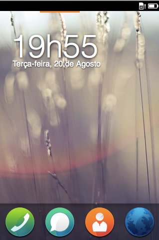

# 简介 {#introduction}

## Firefox OS 火狐操作系统

[Firefox OS](http://www.mozilla.org/firefox/os/)是一个由[Mozilla](http://mozilla.org)及其合作伙伴开发的新的移动平台。许多国家的移动设备都可以运行Firefox OS，并且在今年这个范围还将拓展。针对发展中市场，Firefox OS 的使命是带来下一个十亿在线人数。为了达成它，Firefox OS设备被构建成了一个类似在价格上具有竞争力的伟大第一智能手机。Firefox OS设备与高端智能手机是不可比的，比如苹果iPhone 5S和三星Galaxy S4。它们被构建成功能手机的替代品，当人们使用上述设备时，可以用负担得起的花费升级为Firefox OS并获得所有智能手机体验。

例如在巴西和哥伦比亚这样的发展中市场，对一般消费者来说一部性能优越的智能手机一般是非常昂贵的。人们可以购买廉价手机，但被那些手机所使用的平台是为高端设备准备的。因此，那些硬件表现不佳的手机会导致一个很糟的用户体验。Firefox OS 是专门为在有限的硬件上运行并提供一个相当不错的用户体验而设计的。

另一个Firefox OS区别因素是它的开放性。考虑到在目前主流移动操作系统中每个厂商都有特权去推动其自有方式，而不顾开发者和用户想要的，这些操作系统简直是私有粮仓（还记得苹果尝试在iTunes应用商店中禁止除了Objective-C以外的其他语言吗？）。在这些私有的生态系统中你只能在授权的平台上发布你的应用 - 而且厂商通常会很大比例的占具从其设备上产生的任何购买中的获利。

除了强迫开发者到私有发布平台，这些系统还强迫你使用他们的软件开发工具（SKD）。如果你想要使用官方工具去构建一个iOS和Android的原生应用，你将会需要使用Objective-C和Java去编码一个应用。在编码层面上，这意味着一个开发者在项目间重用的代码将非常少（也许重用一些媒体资源）。那种工作需要开发者学习两种语言构建同样的软件两次。

Firefox OS有别于使用“HTML5”作为开发平台的竞争对手。HTML5是一个市场术语，常常指不断发展的Web标准的集合，比如HTML，CSS和Javascript。那些免费版税的标准是被主流web浏览器实现的，而且是可生产web应用的。借力于这些包含HTML5的技术，数百万的开发者已经能够为Firefox OS编码了。而且为Firefox OS构建的应用通过打包可以轻易被移植到其他平台上，比如使用[Phonegap](http://phonegap.com)。

## 值得HTML5的平台

网络无处不在，在你的电脑，手机，智能电视，甚至是你的视频游戏控制台中。Javascript是全世界最流行的web编程语言之一。如前所述，当人们谈到HTML5时，他们通常是指HTML、CSS和Javascript这三个技术。HTML的最新进展在与XHTML1.0和HTML4.01比较的范围内带来了一些新特性 - 表单控制、Web Sockets还有更多的语义化标签。而CSS也引入了一些新特性，比如Flexbox和CSS动画，使它更易于创造漂亮的响应式布局。Javascript最新的进展则带来了重要的性能改进和新功能，同时保留了对于初学者和老手一样的易用性。

Firefox OS的本质是一个扩展延伸的移动网络。通过将HTML5作为一等公民，Mozilla已经为数百万的web开发者开放了其平台。即使一些其他浏览器厂商在他们的移动产品中实践了HTML5，Firefox OS通过提供的一组使用Javascript的可访问底层硬件和系统的API已将其超越。这些API被统称为WebAPI。

## 使用WebAPI访问硬件

一些较早的平台也尝试过创造可使用web技术的操作系统用于应用创作。比如，当iPhone刚刚在世界范围内崭露头角时，创建应用唯一的方法就是使用web技术。然而那些web应用访问硬件或者说设备都受到了限制，这意味着只能在一个有限的范围内去创作应用。当苹果允许开发者使用Objective-C编码应用，并获得了访问设备的能力时，就引发了大量的创新。悲剧的是web应用不能获得访问设备的能力，因此变成了“二等公民”，这使得其无法吸引用户和开发者，也没有办法在系统中与原生应用竞争。

当我们说设备功能时，我们实际上是指访问的硬件以及操作系统的功能与服务的水平，比如更新电话簿、发送短信、访问相机还有媒体库。在Firefox OS中，[WebAPI](https://wiki.mozilla.org/WebAPI)是你访问大部分那些功能的手段。

另一个较早的平台WebOS也可以通过JavaScript访问硬件，但从未尝试标准化它的API。Mozilla与W3C还有其他相关人士并肩工作，确保WebAPI是一个开放的标准，其他浏览器也将采用它们。随着这些API在其他浏览器中被实现，你的应用在跨平台时将需要越来越少的改变。

这点是非常重要的，WebAPI并不是由Firefox OS独占的。Mozilla是为了在其他平台上运行的Firefox浏览器而实现它的，比如桌面系统和安卓系统。以这样的方式，你可以在Firefox OS、桌面Firefox浏览器和安卓Firefox浏览器中使用你的开放web应用。

## 自由开发与发布

如mozilla做的每件事一样，Firefox OS是在开放与自由中开发出的。所有开发者可以在Github上关注其项目[the Mozilla B2G repository](https://github.com/mozilla-b2g/B2G)。你可以自由的关注它并为系统开发做贡献，你也可以自由的在你自己的平台或者Firefox的市场[The Firefox Marketplace](https://marketplace.firefox.com/)上发布你的应用。最可怕的是所有的系统应用都是基于HTML5写的，所以你能挑出它们来看看如何放在一起。

中心思想是你在任何事上都不会被Mozilla限制。如果你想筛选系统源代码并根据自己的需要改变它，如你所愿。如果你需要在公司局域网建立应用，或者如果你想只在自己的网站上发布你的创作，你都可以自由的去做。通常在其他平台中，你会被迫在官方应用商店这样的唯一平台上发布你的应用。Firefox OS也有一个官方市场叫做Firefox MarketPlace，它有一个审批流程，但只要你想，你就可以在其他地方任意发布你的应用。就像在网络上你可以在任何你所想的地方托管你的网站一样，在Firefox OS中你可以对你的应用做相同的事。

这里还有一个小小的警告，悲剧的是：有些WebAPI同意任何人使用是有安全问题的。所以使用更多“privileged”的API，你可能需要获取你的应用的签名和Mozllia的评估。

## 总结

HTML5在这里将是更好的。Firefox OS是由Mozilla完成基于web技术的一个新的开放性移动操作系统。该系统被公开建立并提供了一个强壮的HTML5实现环境，通过提供一组可使用 *JavaScript访问硬件与操作系统服务* 的API即WebAPI而超越了其他平台。这些新的API是通过万维网联盟（W3C）标准化的，并且很有希望在将来被其他浏览器适应。

在下一个章节，我们将很快带来开发Firefox OS的每一个配置。
