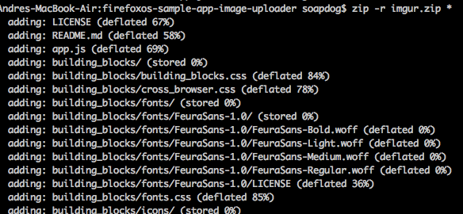
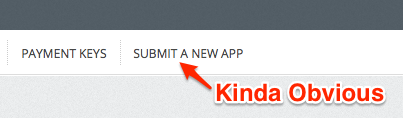
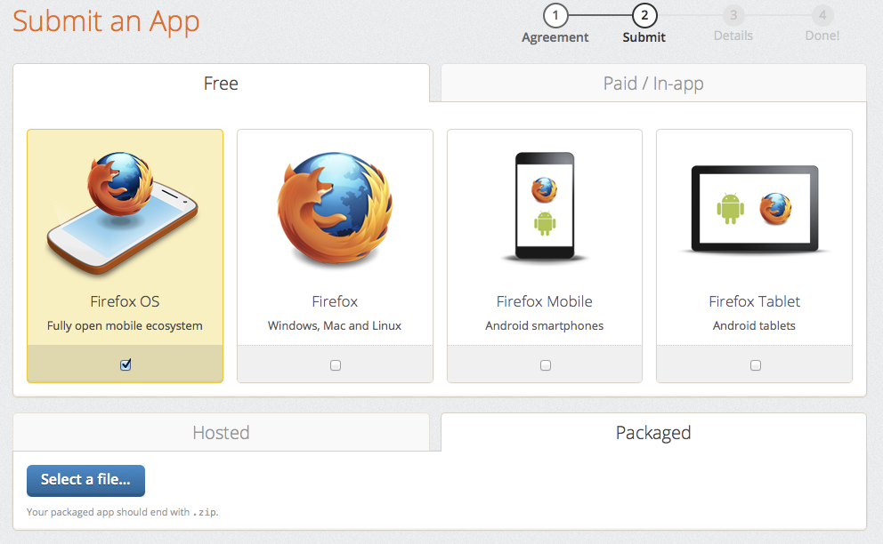
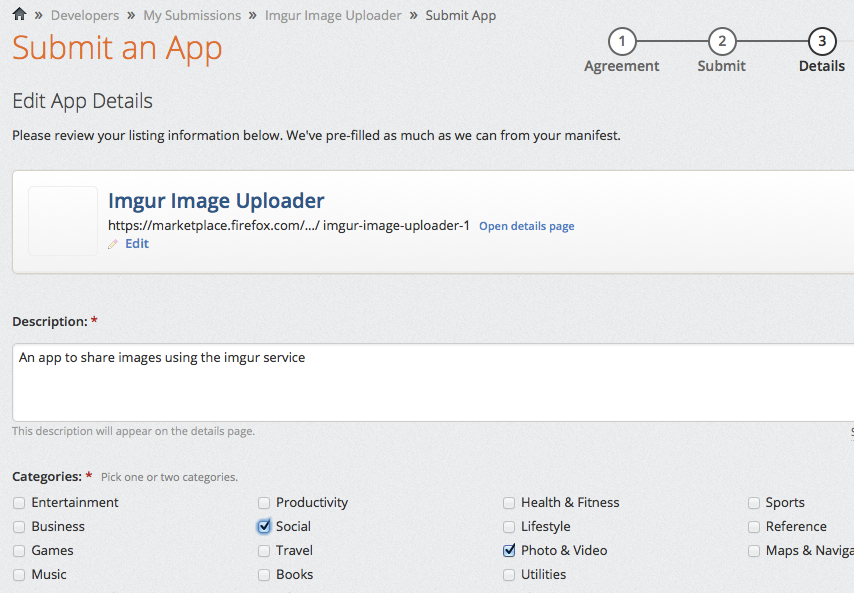

# Firefox Marketplace应用市场

[Firefox Marketplace应用市场](http://marketplace.firefox.com)是一个在线商店，你可以在上面购买或下载Firefox OS、Firefox浏览器以及安卓上Firefox浏览器的应用。这里的主要栏目是发布Firefox OS应用，不过你不一定要使用它。如果你想在marketplace应用市场以外的地方发布一些东西，可以阅读[下一章节](#distribution)。

要在marketplace应用市场中发布你的应用，你需要通过[Mozilla Persona](https://login.persona.org/about)的认证。只需点击**登录**并按照指示进行。一旦你注册好，你就能提交应用到Firefox Marketplace应用市场了。

## 在发送应用到应用市场以及有任何想法之前的核对清单。

所有要被提交到marketplace应用市场的应用程序都要经历一个审批流程（没有听起来这么可怕！）。托管web应用经过的审批流程比特权应用少的多，因为它们使用影响较小的API。在发送你的应用到marketplace应用市场之前，查看[marketplace应用市场审查条款](https://developer.mozilla.org/en-US/docs/Web/Apps/Publishing/Marketplace_review_criteria)。最重要的部分是（个人意见）：

* Firefox OS设备没有类似安卓和你的桌面浏览器一样的**返回按钮**。如果用户在你的应用中导航到一个界面而没办法返回到之前的地方（例如，用户被卡住）， 你的应用会被拒。
*你的应用应该有60x60的图标和清晰的介绍。
*你的应用应该做描述说明。说明一个东西或提供一些东西，否则会把你的应用拒绝。
*如果你的应用申请了权限许可，那你应该在你的代码中使用它。声明你的应用为特权应用而不使用任何特权应用API，将意味着你再次提交无格式应用的请求会被拒。
* 你的应用程序需要有*隐私政策*。
*清单文件应该有正确的MIME type，并且作为托管应用应该来自同一域名。

上面的链接中还讨论了其他标准，并且规则会在没有通知的情况下改变。该页面值得你花费一些时间阅读它。你的应该很可能由于修复会花费很多时间这样的小事而被拒。最好在一开始就把事情做对（好应用更容易被审查员批准！）。

## 为了提交你的应用做准备

根据它是一个托管应用还是打包应用，提交你的应用程序到marketplace应用市场需要的步骤是不同的。作为一个托管应用，它只要是可在线接受的，有正确的MIME type和清单。打包应用需要使用*zip*打包并应有一些特别的注意事项。

需要开发者错误的选择了包括应用文件的文件夹打包。这是因为zip文件包含一个文件夹并且该文件夹包含应用。这是压缩Firefox OS应用不正确的方法。正确方法是压缩需要的文件夹和文件，以至于清单在zip文件的*根目录*中。在Mac OS X和Linux上，你可以使用终端（terminal）去导航你的应用程序文件夹并使用一个命令，比如`zip -r myapp.zip *`去正确的压缩它们，就像下面截图显示的一样。

该zip文件是我们发给marketplace应用市场的。

## 提交你的应用到marketplace应用市场。

现在你的应用准备就绪，并且熟练掌握了符合审查标准的知识，是时候让我们把它发给marketplace应用市场了。使用应用市场页面顶部的齿轮按钮浏览**My Submissions**。

在应用管理页面中，你需要点击顶部菜单的**Submit An App**。

该链接将带你到提交新应用的表单，就像下面的截图一样。

在这个页面上你可以选择如下选项：

* 应用程序是托管应用还是打包应用。
* 它是免费还是付费（或使用*应用内购买*）
* 适用于什么设备类型（Firefox OS，Firefox 桌面，手机上的移动版Firefox浏览器，平板电脑上的移动版Firefox浏览器）。

在做出选择后你会被带到第二屏。在本书中我们关注打包应用，但是托管应用更简单。
After making these choices you're driven to the second screen. On this book we're focusing on packaged apps but hosted apps are similar. 

In the remaining text of this chapter we're assuming that we're shipping a free Firefox OS packaged app. In this case we need to upload the zip file we prepared on the previous section.

After uploading the file, it undergoes an automated process and a report is shown with many options.

From the screen shot above we can see that the app I sent to the marketplace has no errors but contains six warnings. Ignoring the warnings for the sake of this text, lets check what the **minimum requirements** for this app are. In this case, the last option *Smartphone-Sized Displays (qHD)* should be unchecked because our application adapts to any screen size.

The next step is called **Step #3: Details** and it is where you fill the information about your application such as category, description, screen captures, etc.

After filling-in the details, the submission process is done. Now you just wait for the approval from the marketplace reviewers. Congratulations you shipped a Firefox OS application!!!

On the [Application Management page](https://marketplace.firefox.com/developers/submissions) you can check the status of your submissions and alter details if needed.

To learn more about submitting applications to the Firefox Marketplace read [this article on the Firefox OS developer hub](https://marketplace.firefox.com/developers/docs/submission).

## Summary

Congratulations!!! You have a new application on the Firefox Marketplace, you're exploring a brand new market!

I hope you enjoyed this quick guide. I plan to update and expand this guide often - so keep your eyes open and register for the updates. If you downloaded this book from Leanpub then its all good because you will receive emails about any updates. If you downloaded it from somewhere else then please consider fetching it from [the official page at Leanpub](http://leanpub.com/quickguidefirefoxosdevelopment) and registering your email. It's free and, no, you won't get any spam. Promise. 

Please send me feedback. This book was written by pulling all-nights before a tech conference so you can infer how much I enjoy this project and want to see it succeed. I can be reached for feedback on my Twitter account at [@soapdog](http://twitter.com/soapdog) and over email at [fxosquickguide@andregarzia.com](mailto:fxosquickguide@andregarzia.com). My home page is at [http://andregarzia.com](http://andregarzia.com).

Now that you're a part of the group of Firefox OS app creators, come be a part of the greater Mozilla community: Help keep the web free and open made by users for users. Join us at [http://www.mozilla.org/contribute/](http://www.mozilla.org/en-US/contribute/) and help Firefox OS grow!

