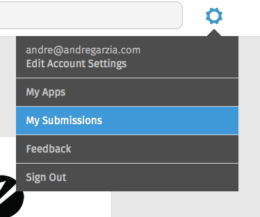
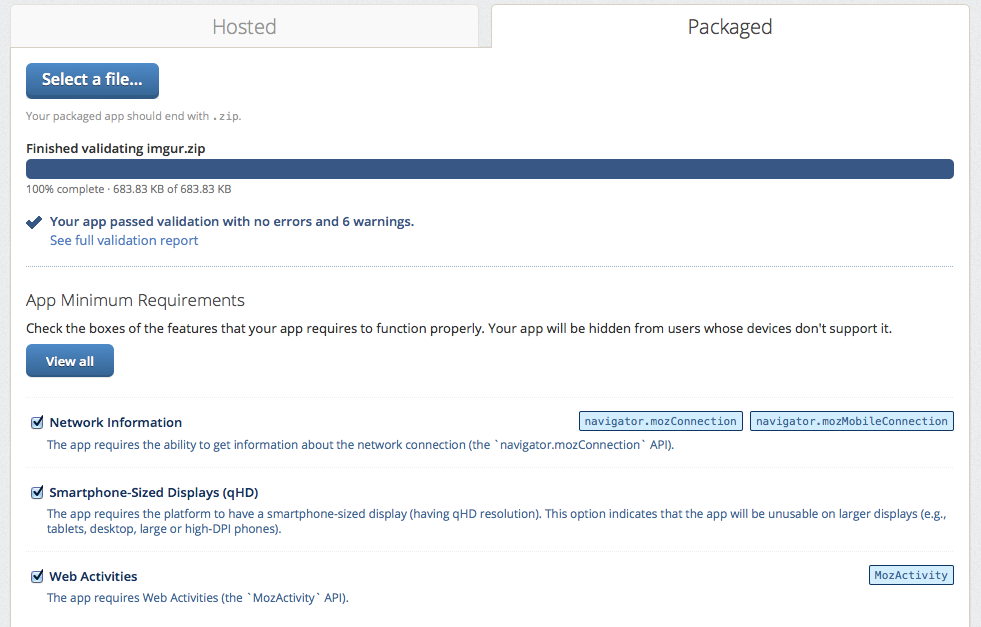

# Firefox Marketplace应用市场

[Firefox Marketplace应用市场](http://marketplace.firefox.com)是一个在线商店，你可以在上面购买或下载Firefox OS、Firefox浏览器以及安卓上Firefox浏览器的应用。这里的主要栏目是发布Firefox OS应用，不过你不一定要使用它。如果你想在marketplace应用市场以外的地方发布一些东西，可以阅读[下一章节](#distribution)。

要在marketplace应用市场中发布你的应用，你需要通过[Mozilla Persona](https://login.persona.org/about)的认证。只需点击**登录**并按照指示进行。一旦你注册好，你就能提交应用到Firefox Marketplace应用市场了。

## 在发送应用到应用市场以及有任何想法之前的核对清单。

所有要被提交到marketplace应用市场的应用程序都要经历一个审批流程（没有听起来这么可怕！）。托管web应用经过的审批流程比特权应用少的多，因为它们使用影响较小的API。在发送你的应用到marketplace应用市场之前，查看[marketplace应用市场审查条款](https://developer.mozilla.org/en-US/docs/Web/Apps/Publishing/Marketplace_review_criteria)。最重要的部分是（个人意见）：

* Firefox OS设备没有类似安卓和你的桌面浏览器一样的**返回按钮**。如果用户在你的应用中导航到一个界面而没办法返回到之前的地方（例如，用户被卡住）， 你的应用会被拒。
*你的应用应该有60x60的图标和清晰的介绍。
*你的应用应该做描述说明。说明一个东西或提供一些东西，否则会把你的应用拒绝。
*如果你的应用申请了权限许可，那你应该在你的代码中使用它。声明你的应用为特权应用而不使用任何特权应用API，将意味着你再次提交无格式应用的请求会被拒。
* 你的应用程序需要有*隐私政策*。
*清单文件应该有正确的MIME type，并且作为托管应用应该来自同一域名。

上面的链接中还讨论了其他标准，并且规则会在没有通知的情况下改变。该页面值得你花费一些时间阅读它。你的应该很可能由于修复会花费很多时间这样的小事而被拒。最好在一开始就把事情做对（好应用更容易被审查员批准！）。

## 为了提交你的应用做准备

根据它是一个托管应用还是打包应用，提交你的应用程序到marketplace应用市场需要的步骤是不同的。作为一个托管应用，它只要是可在线接受的，有正确的MIME type和清单。打包应用需要使用*zip*打包并应有一些特别的注意事项。

需要开发者错误的选择了包括应用文件的文件夹打包。这是因为zip文件包含一个文件夹并且该文件夹包含应用。这是压缩Firefox OS应用不正确的方法。正确方法是压缩需要的文件夹和文件，以至于清单在zip文件的*根目录*中。在Mac OS X和Linux上，你可以使用终端（terminal）去导航你的应用程序文件夹并使用一个命令，比如`zip -r myapp.zip *`去正确的压缩它们，就像下面截图显示的一样。

该zip文件是我们发给marketplace应用市场的。

## 提交你的应用到marketplace应用市场。

现在你的应用准备就绪，并且熟练掌握了符合审查标准的知识，是时候让我们把它发给marketplace应用市场了。使用应用市场页面顶部的齿轮按钮浏览**My Submissions**。

在应用管理页面中，你需要点击顶部菜单的**Submit An App**。

该链接将带你到提交新应用的表单，就像下面的截图一样。

在这个页面上你可以选择如下选项：

* 应用程序是托管应用还是打包应用。
* 它是免费还是付费（或使用*应用内购买*）
* 适用于什么设备类型（Firefox OS，Firefox 桌面，手机上的移动版Firefox浏览器，平板电脑上的移动版Firefox浏览器）。

在做出选择后你会被带到第二屏。在本书中我们关注打包应用，但是托管应用更简单。

在本章剩余的内容中，我们假设我们免费提交Firefox OS的打包应用。这种情况下，我们需要上传前面准备的zip文件。

上传文件后，它经过自动处理并出现报告，显示了许多选项。

在截屏上我们可以看到我发到应用市场的应用，没有错误，但包含了六个警告。忽略文本理由的警告，让检查该应用 **最低需求** 是什么。在这种情况下，最后的选项 *智能手机显示尺寸（qHD）*应该不会被检查，因为我们的应用程序适配于任何屏幕尺寸。

下一步就是**步骤 #3：详情**，在这填上关于你的应用程序的信息，比如分类、描述、屏幕捕获等。

填入之后，提交过程就完了。现在你只需要等待应用市场的检查者的批准。恭喜你发布了Firefox OS应用程序！！！

在[应用程序管理页面](https://marketplace.firefox.com/developers/submissions)你可以检查你的提交状态，如果需要的话还可以修改详情。

要学习更多向Firefox应用市场提交应用程序，可以读[Firefox OS开发者文集](https://marketplace.firefox.com/developers/docs/submission)。

## 总结

恭喜！！！你在Firefox应用市场有了新的应用程序，你正探索一个全新的市场。

我希望你喜欢本快速指导。我计划经常更新并扩展该指导，所以持续注视并记录更新。如果你从Leanpub下载了它，那都是可以的，因为你将收到所有更新的邮件。如果你从其他哪里下载了它，那请考虑从[Leanpub上的官方页面](http://leanpub.com/quickguidefirefoxosdevelopment)获取，并注册你的电子邮件地址。这是免费的，并且没有任何广告，我发誓。

请给我反馈。本书是在一个技术会议的整个晚上写出的，所以你会推断出我有多爱这个项目，有多想看它完成。我可以在我的Twitter账户[@soapdog](http://twitter.com/soapdog)上收集反馈，还有电子邮箱[fxosquickguide@andregarzia.com](mailto:fxosquickguide@andregarzia.com)。我的主页是[http://andregarzia.com](http://andregarzia.com)。

现在你是Firefox OS应用创造者的一员啦，来成为更大的Mozilla社区的一员吧：帮助用户保持网络开发与免费。在[http://www.mozilla.org/contribute/](http://www.mozilla.org/en-US/contribute/)加入我们，帮助Firefox OS成长。
