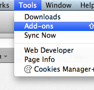

# 配置Firefox OS应用开发环境 {#setup}

## Gecko引擎
各浏览器使用不同的引擎渲染网页：谷歌Chrome浏览器和Opera使用Blink（一个WebKit分支），Internet Explorer使用Trident，然而Safari使用WebKit。在桌面系统Firefox浏览器、安卓Firefox浏览器和Firefox OS中Mozilla有自己的引擎叫做Gecko。由于这些产品使用相同的引擎，所以使用桌面Firefox浏览器来进行Firefox OS开发是可能的（但是有一些警告[^engines]）。

[^engines]: 虽然所有的Mozilla产品都使用相同的引擎，但在Firefox OS中引擎版本通常会落后其桌面浏览器。这是因为Firefox OS的发布周期一般比桌面浏览器要慢。在实践中，这意味着当你在Firefox OS中尝试一些特性时可能不太适应（或者不能如预期的工作） - 所以你总应确保在一个运行Firefox OS的设备中测试你的应用。另外需要注意的是用户可能也存在不同的Firefox OS版本，所以他们可能没有前沿的特性，在一些特性不可用时始终要确保一个降级方案。

## 你需要什么应用?

开发和测试一个Firefox OS的应用，你将需要：

 * 一个最新版的[Firefox 浏览器](http://getfirefox.com)。
 * [Firefox OS 模拟器](https://addons.mozilla.org/en-US/firefox/addon/firefox-os-simulator/)。
 * 一个代码编辑器[^editors]。
 
[^editors]: 在复杂度和特性方面有许多不同水准的优秀编辑器。对于那些没有特定喜好的人，我推荐使用一个非常流行的[SublimeText](http://sublimetext.com/)。就我自己而言，我使用[WebStorm](http://www.jetbrains.com/webstorm/)，一个在web应用开发方面功能完备的IDE。
  
## 安装Firefox OS 模拟器

安装Firefox浏览器后，下一步是安装Firefox OS模拟器并使用其测试我们的应用。安装Firefox并执行它，在 **工具** 菜单中选择 **附加组件** 。

使用右上角的搜索框搜索 **Firefox OS Simulator** 并点击安装按钮安装该插件。

安装附加组件后，你将能够通过菜单 **工具 -> 开发者工具 -> Firefox OS Simulator** 访问模拟器。

或者你可以进入到[Firefox OS 模拟器](https://addons.mozilla.org/en-US/firefox/addon/firefox-os-simulator/) 插件页面，从这里下载模拟器。

## 总结

在这一章我们完全学到了我们开发Firefox OS应用需要的是Firefox浏览器和Firefox OS模拟器（还有一个好编辑器）。

现在我们安装所有我们需要的工具，在我们创建第一个应用之前，让我们学习一些基本概念。